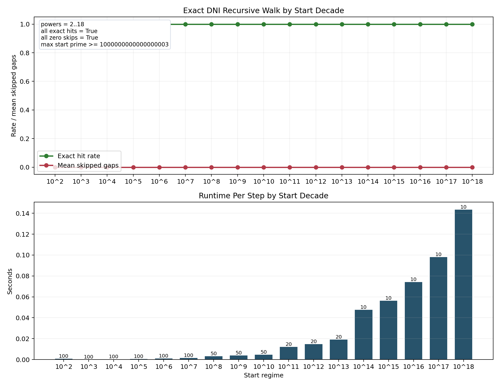

# Prime Gap Structure


This repository carries two linked results from the same divisor-normalized
arithmetic program.

The executable artifact is a deterministic cryptographic prime prefilter whose
invariant target is the exact **Divisor Normalization Identity** (DNI)

$$
Z_{\mathrm{raw}}(n) = n^{1 - d(n)/2}
$$

at normalization scaling parameter

$$
v = \frac{e^{2}}{2}.
$$

The headline mathematical result now carried by the repository is the
committed theorem statement
[Gap Winner Rule — Hierarchical Local-Dominator Law](gwr/findings/gwr_hierarchical_local_dominator_theorem.md).
Inside a prime gap, the implemented log-score

$$
L(n) = \ln Z_{\mathrm{raw}}(n) = \left(1 - \frac{d(n)}{2}\right)\ln(n)
$$

is maximized exactly at the leftmost interior carrier of the smallest divisor
class present in the gap. The same theorem statement records the two flank
conditions used throughout the repo: every earlier composite is beaten by a
later admissible composite, and no later strictly simpler composite appears
before the gap closes.

## Current Headline Results

- **Exact DNI/GWR recursive prime walk.** The repository now carries an exact
  deterministic no-skip sequential prime walk on the tested surface. The
  extended DNI transition rule is exact on the combined $10^6 + 10^7$
  next-gap surface with `743,075 / 743,075` exact transitions, and the
  recursive walk records `664,578 / 664,578` exact consecutive next-prime
  recoveries from prime `11` through prime `10,000,121` with `0` skipped
  gaps. The sampled decade ladder from $10^2$ through $10^18$ also stayed at
  exact hit rate `1.0` with `0` skipped gaps across `860` measured recursive
  steps. See
  [docs/research/predictor/gwr_dni_exact_recursive_prime_walk_note.md](docs/research/predictor/gwr_dni_exact_recursive_prime_walk_note.md).
- **Formal theorem statement.** The current headline theorem is
  [gwr/findings/gwr_hierarchical_local_dominator_theorem.md](gwr/findings/gwr_hierarchical_local_dominator_theorem.md).
  It states the winner law directly in hierarchical first-arrival and
  local-dominator form.
- **Exact full left-flank scan through $2 \times 10^7$.** The committed
  artifact
  [output/gwr_proof/earlier_spoiler_local_dominator_scan_2e7.json](output/gwr_proof/earlier_spoiler_local_dominator_scan_2e7.json)
  reports `1,163,198` gaps, `3,349,874` earlier candidates, and `0`
  unresolved.
- **Exact no-early-spoiler surface through $2 \times 10^7$.** The committed
  artifact
  [output/gwr_proof/no_early_spoiler_margin_scan_2e7.json](output/gwr_proof/no_early_spoiler_margin_scan_2e7.json)
  reports `1,163,198` gaps, `3,349,874` earlier candidates before the true
  `GWR` carrier, and `0` exact earlier spoilers. The companion artifacts
  [output/gwr_proof/no_early_spoiler_ratio_frontier_2e7.json](output/gwr_proof/no_early_spoiler_ratio_frontier_2e7.json),
  [output/gwr_proof/large_gap_margin_scan_2e7.json](output/gwr_proof/large_gap_margin_scan_2e7.json),
  and
  [output/gwr_proof/asymptotic_bridge_load_scan_2e7.json](output/gwr_proof/asymptotic_bridge_load_scan_2e7.json)
  record the exact pair frontier, large-gap companion surface, and normalized
  bridge-load surface for the same no-early-spoiler condition.
- **Square-adjacent stress test at $10^{12}$.** The matched pre-square and
  post-square artifact
  [output/gwr_proof/earlier_spoiler_local_dominator_scan_square_adjacent_1e12.json](output/gwr_proof/earlier_spoiler_local_dominator_scan_square_adjacent_1e12.json)
  reports `137,771` gaps, `649,769` earlier candidates, and `0` unresolved.
- **Current proof bridge status.** The note
  [gwr/experiments/proof/proof_bridge_universal_lemma.md](gwr/experiments/proof/proof_bridge_universal_lemma.md)
  isolates the remaining large-$p$ bridge as an explicit-constant task, and
  the helper
  [gwr/experiments/proof/proof_bridge_certificate.py](gwr/experiments/proof/proof_bridge_certificate.py)
  checks concrete gap-bound and divisor-growth parameter choices against the
  exact finite base already committed in the repo. The current proof-facing
  status is therefore: exact finite base through $2 \times 10^7$, explicit
  normalized bridge target identified, universal closure still dependent on
  chosen effective constants.
- **No-Later-Simpler-Composite condition.** Once the implemented winner
  appears inside a tested prime gap, the next prime arrives before any later
  interior composite with strictly smaller divisor count. The dedicated closure
  study reports zero observed violations on a deterministic even-band ladder at
  every decade from $10^8$ through $10^{18}$. See the
  [theorem candidate note](gwr/findings/no_later_simpler_composite_theorem.md)
  and the
  [findings summary](gwr/findings/closure_constraint_findings.md).
- **Dominant $d=4$ reduction.** In the dominant winner regime, the tested gaps
  admit no interior prime square, and the implemented winner is exactly the
  first interior carrier with $d(n)=4$. This holds on exact full scans at
  $10^6$ and $2 \times 10^7$ and on the deterministic even-band ladder through
  $10^{18}$, while the stricter semiprime-only wording is explicitly falsified
  by a thin prime-cube exception family. See the
  [findings note](gwr/findings/dominant_d4_arrival_reduction_findings.md) and
  the
  [theorem candidate note](gwr/findings/square_exclusion_first_d4_theorem.md).
- **Deterministic prefilter performance.** The current production Python path
  rejects about $91\%$ of tested odd candidates before Miller-Rabin and
  produced $2.09\times$ and $2.82\times$ end-to-end deterministic RSA
  key-generation speedups on the curated $2048$-bit and $4096$-bit benchmark
  corpora. See [docs/prefilter/benchmarks.md](docs/prefilter/benchmarks.md).

## Exact Recursive Prime Walk

The newest predictor result in this repository is not a loose heuristic and
not a skip-prone gap jumper. On the current verified surface, it is an exact
deterministic sequential generator:

1. use the bounded DNI cutoff rule as a finite compression of the exact
   next-gap mechanism,
2. recover the immediate next gap minimum divisor class and its first carrier,
3. recover the immediate next prime exactly,
4. repeat with zero skipped gaps.

The predictor note is documented in
[docs/research/predictor/gwr_dni_exact_recursive_prime_walk_note.md](docs/research/predictor/gwr_dni_exact_recursive_prime_walk_note.md).
The strongest verified numbers are:

- exact next-gap transition rate `1.0` on `743,075` rows from the combined
  $10^6 + 10^7$ surface;
- exact recursive walk `664,578 / 664,578` from prime `11` through prime
  `10,000,121`, with `0` skipped gaps;
- sampled decade sweep from $10^2$ through $10^{18}$ at exact hit rate `1.0`
  with `0` skipped gaps across `860` measured recursive steps;
- largest observed next-gap peak offset in that sampled decade sweep: `32`,
  still well inside the current tested continuation bound.

This is a significant change in status for the predictor program. The repo now
has an implemented and verified DNI/GWR next-prime walk on the tested surface,
not merely a witness recovery rule waiting on a seed.

The theorem boundary is now sharper too. The unbounded DNI/GWR transition is
exact by construction: scan the next-gap interior until the first prime
boundary and take the lexicographic divisor minimum. The open question is only
whether the finite cutoff map `2 -> 44`, `4 -> 60`, `6 -> 60` always matches
that exact unbounded mechanism. The canonical test surface for that theorem is
[benchmarks/python/predictor/gwr_dni_cutoff_counterexample_scan.py](benchmarks/python/predictor/gwr_dni_cutoff_counterexample_scan.py).



## Gap Winner Rule

The central winner law in this repository is that the log-score argmax inside a
prime gap collapses to a simpler arithmetic choice:

1. minimize the interior divisor count $d(n)$,
2. among ties, take the leftmost interior carrier.

That is the Gap Winner Rule.

The formal theorem file expresses this as a hierarchical local-dominator law.
The executed artifacts in this repo then show zero unresolved earlier spoilers
on the full exact surface through $2 \times 10^7$ and on the matched
square-adjacent windows at $10^{12}$.

The newer no-early-spoiler artifacts sharpen that same picture against the
actual winner itself. On the full exact through-$2 \times 10^7$ surface, the
repo records zero exact earlier spoilers against the true `GWR` carrier,
identifies the tightest realized winner/earlier divisor-class frontier, shows
that the largest gaps are not the hard regime, and packages the remaining
universal target as a normalized bridge load. See
[gwr/findings/no_early_spoiler_margin_findings.md](gwr/findings/no_early_spoiler_margin_findings.md),
[gwr/findings/no_early_spoiler_ratio_frontier_findings.md](gwr/findings/no_early_spoiler_ratio_frontier_findings.md),
[gwr/findings/large_gap_margin_findings.md](gwr/findings/large_gap_margin_findings.md),
and
[gwr/findings/asymptotic_bridge_load_findings.md](gwr/findings/asymptotic_bridge_load_findings.md).

This one law compresses several separate-looking features on the prime-gap
interior surface:

- frequent $d(n)=4$ winners,
- strong left-half winner dominance,
- frequent edge-distance $2$ winners.

Those are not separate committed rules in the current reading. They are
consequences of the same winner law when it holds.

The dominant winner class now has a documented local reduction of its own.
On the current exact-and-band surface, every tested gap with winner class
$d(w)=4$ contains no interior prime square, and its true winner is exactly the
first interior carrier with $d(n)=4$. That gives the leading regime a visible
mechanism: square exclusion first, then first-$d=4$ arrival. The stricter
semiprime-only slogan is false; a thin prime-cube exception family survives
inside the broader $d=4$ class.

See [gwr/story/README.md](gwr/story/README.md) for the plain-language write-up,
[gwr/findings/gwr_hierarchical_local_dominator_theorem.md](gwr/findings/gwr_hierarchical_local_dominator_theorem.md)
for the current committed theorem statement,
[gwr/findings/gap_winner_rule.md](gwr/findings/gap_winner_rule.md) for the
winner-law note, and
[gwr/findings/lexicographic_raw_z_dominance_theorem.md](gwr/findings/lexicographic_raw_z_dominance_theorem.md)
for the surviving directional dominance theorem that sits beneath the gap-local
collapse. See
[gwr/findings/dominant_d4_arrival_reduction_findings.md](gwr/findings/dominant_d4_arrival_reduction_findings.md)
and
[gwr/findings/square_exclusion_first_d4_theorem.md](gwr/findings/square_exclusion_first_d4_theorem.md)
for the dominant-case reduction and its theorem-candidate form.

## No-Later-Simpler-Composite Theorem Candidate

The strongest closure consequence currently documented in the repository is
this:

once the implemented winner appears inside a prime gap, the next prime arrives
before any later interior composite with strictly smaller divisor count can
appear.

In symbols, if $w$ is the implemented log-score winner in the gap $(p, q)$ and

$$
T_{<}(w) = \min \{\, n > w : d(n) < d(w) \,\},
$$

then the closure condition is

$$
q \le T_{<}(w).
$$

This is an exact corollary of GWR on any gap where GWR holds. The separate
question is whether it can stand on its own as a direct prime-gap theorem.

The current documented surface for this closure condition includes a
deterministic even-band ladder at every decade from $10^8$ through $10^{18}$.
That ladder reports zero observed violations. The common $d(w)=4$ case is
especially concrete: the first later strictly simpler threat is then the next
prime square after $w$, so the condition becomes a direct bound on where the
gap must close.

See
[gwr/findings/no_later_simpler_composite_theorem.md](gwr/findings/no_later_simpler_composite_theorem.md)
and
[gwr/findings/closure_constraint_findings.md](gwr/findings/closure_constraint_findings.md).

## Scope At A Glance

- The exact DNI is an arithmetic identity under exact divisor count.
- The production prefilter does not compute exact divisor count on cryptographic-size candidates at runtime.
- In the production path, `proxy_z = 1.0` means only that the candidate survived the current gated factor tables and therefore advances to Miller-Rabin. It is not a primality proof by itself.
- The reported `~91%` Miller-Rabin reduction is the measured consequence of the current covered odd-prime table depth on the tested deterministic streams, not a runtime evaluation of exact DNI. See [docs/prefilter/benchmarks.md](docs/prefilter/benchmarks.md) and the table-depth sweep discussed there.
- The gap-ridge notes study the exact raw composite `Z` field inside prime gaps. That is a separate empirical concern from the production prefilter.

## Terminology

This repository uses precise language to name structural roles inside one discrete arithmetic normalization. The terminology is intended literally within that setting. It does not claim that the integers in this repository have been equipped with a smooth Riemannian manifold structure or a physical time evolution.

- **Divisor normalization load** names the scalar quantity $\kappa(n) = d(n)\ln(n)/e^2$. It measures how far an integer has moved away from the minimal-divisor prime case once divisor structure and logarithmic scale are combined.
- **Z-Band** names the straight fixed-point regime selected by the normalization. Under the exact DNI, primes occupy the fixed-point locus $Z = 1.0$, while composites deviate below it as additional factor structure appears.
- **Normalization scaling parameter** names the scalar $v$ in the Z-transform $Z(n) = n / \exp(v \cdot \kappa(n))$. The distinguished value $v = e^2/2$ is the fixed-point parameter because it produces the exact collapse $Z(n) = n^{1 - d(n)/2}$.
- **Fixed-point locus** names the normalized set $Z = 1.0$ picked out by the exact identity for the prime class.
- **Ridge** names a measured concentration of local maxima in the exact raw composite Z-field inside prime gaps.

## Overview

Every positive integer has a divisor pattern.

- A prime has exactly two positive divisors: 1 and itself.
- A composite has additional positive divisors.

This distinction is the starting point. A number with more exact divisors carries more internal factor structure than a number with fewer. Divisor count alone, however, is not enough, because the same divisor count does not mean the same thing at different scales. The approach therefore combines divisor structure with logarithmic size.

The logarithmic term accounts for magnitude in a balanced way. It registers growth in size without letting raw magnitude overwhelm the structural signal. Moving from $10$ to $100$ to $1000$ produces steady increments, so divisor structure can be compared meaningfully across small and large integers.

The resulting combined quantity is called the divisor normalization load. This load measures the departure of an integer from the minimal divisor case. This is the simplest structure represented by a prime. Primes have the lowest load. As additional exact divisors appear, the integer carries more internal branching relative to that baseline. When divisor structure and logarithmic scale are taken together, this accumulated departure is the quantity denoted by $\kappa(n)$.

We call the resulting law the **Divisor Normalization Equation**:

$$
\kappa(n) = \frac{d(n) \cdot \ln(n)}{e^{2}}
$$

where:

- $d(n)$ is the divisor count of $n$
- $\ln(n)$ is the natural logarithm of $n$
- $e^{2}$ is the normalization constant

This equation measures how much factor structure an integer carries once scale is taken into account. With the divisor normalization load defined, primes are the minimal case under this measure, while composites carry increasingly more structural load. This is the sense in which the framework speaks of straightness or load in the discrete integer field used in this repository.

## Divisor Normalization Identity

The divisor normalization load signal becomes useful when it is passed through the Z-transform:

$$
Z(n) = \frac{n}{\exp(v \cdot \kappa(n))}
$$

where $v$ is the normalization scaling parameter.

For the prime-gap structure program in this repository, the distinguished value is

$$
v = \frac{e^{2}}{2}
$$

because it produces an exact cancellation. Substitute the Divisor Normalization Equation into the Z-transform:

$$
Z(n) = \frac{n}{\exp\left(v \cdot \frac{d(n) \cdot \ln(n)}{e^{2}}\right)}
$$

Now set $v = e^{2}/2$:

$$
\begin{align*}
Z(n) &= \frac{n}{\exp\left(\frac{e^{2}}{2} \cdot \frac{d(n) \cdot \ln(n)}{e^{2}}\right)} \\
&= \frac{n}{\exp\left(\frac{d(n)}{2} \cdot \ln(n)\right)} \\
&= \frac{n}{n^{d(n)/2}} \\
&= n^{1 - d(n)/2}
\end{align*}
$$

So the **Divisor Normalization Identity** (DNI) $Z(n) = n^{1 - d(n)/2}$ is

$$
Z(n) = n^{1 - d(n)/2}
$$

This has an immediate effect:

- Prime: $d(p) = 2$, so $Z(p) = 1$
- Semiprime with two distinct prime factors: $d(n) = 4$, so $Z(n) = 1/n$
- Composite in general: $d(n) > 2$, so $Z(n) < 1$

Under the exact DNI, the entire prime class collapses to the fixed-point locus $Z = 1.0$. Composites are pushed strictly below that locus.

## Why This Becomes a Prefilter

This fixed-point separation is the practical core of the method. Cryptographic prime generation spends most of its time on candidates that are composite and never need a full probable-prime path. The exact DNI provides the invariant target. The production implementation below is the bounded deterministic surrogate calibrated against that target rather than a runtime exact-divisor evaluator.

Because confirmed primes live at $Z = 1.0$ under the DNI and composites contract below it, the prefilter creates a clean structural separation in normalized space. That separation makes it possible to reject many candidates before paying the full cost of the survivor regime.

## Production Filter

The exact DNI depends on exact divisor count. That exact path is valuable as the derivation and as the oracle, but it is not the runtime path for cryptographic-scale key generation.

The production implementation in this repository therefore uses a deterministic surrogate with the same invariant target:

- generate deterministic odd candidates from a SHA-256 namespace/index stream
- reject immediately when a concrete factor appears in the gated prime tables
- keep survivors on the locus convention `proxy_z = 1.0`
- run fixed-base Miller-Rabin on survivors
- apply final `sympy.isprime` confirmation in the current Python path

So the logic flows in one direction:

- the Divisor Normalization Equation defines the structural signal
- the normalization scaling parameter turns that signal into the prime DNI locus
- the locus creates a usable structural separation
- the production filter exploits that separation to reduce Miller-Rabin work

The current measured rejection rate comes from the covered prime-table depth of this implementation. The repository includes deterministic table-depth sweeps to show that dependence directly rather than attributing the `~91%` figure to runtime exact DNI evaluation.

Empirically, this extracted Python path produced:

- $2.09\times$ end-to-end speedup across $300$ deterministic $2048$-bit RSA keypairs
- $2.82\times$ end-to-end speedup across $50$ deterministic $4096$-bit RSA keypairs
- $90.97\,\%$ to $91.07\,\%$ Miller-Rabin reduction in the current covered-table configuration

## Empirical Results

### End-to-End RSA Key Generation

- $2048$ bits, $300$ deterministic keypairs:  
  baseline $291938.126792$ ms  
  accelerated $139942.831833$ ms  
  speedup $2.09\times$  
  Miller-Rabin reduction $90.97\,\%$
- $4096$ bits, $50$ deterministic keypairs:  
  baseline $757750.922792$ ms  
  accelerated $268557.631625$ ms  
  speedup $2.82\times$  
  Miller-Rabin reduction $91.07\,\%$

### Candidate-Loop Screening

- $2048$-bit control corpus:  
  proxy rejection $91.02\,\%$  
  pipeline speedup $2.95\times$
- $4096$-bit control corpus:  
  proxy rejection $91.41\,\%$  
  pipeline speedup $3.33\times$

### DNI Calibration

- $29/29$ calibration primes stayed on $Z = 1.0$
- $0$ composite false fixed points

### Exact Raw Composite Z Field

- This is a separate exact-field concern from the production prefilter.
- Up to $10^6$ on the natural number line, the strongest exact raw composite
  $Z$ value inside a prime gap lands at edge-distance $2$ in $43.6006\%$ of
  gaps versus an exact within-gap baseline of $22.1859\%$, and is carried by a
  $d(n)=4$ composite in $82.9027\%$ of gaps versus a baseline of $20.1401\%$.
- Later repository notes sharpen that ridge picture into the current winner
  law: on the documented validation surfaces, the implemented log-score winner
  matches the arithmetic choice “minimize interior divisor count, then take the
  leftmost carrier,” with zero observed counterexamples on the current
  revalidation ladder and on earlier committed sampled surfaces through
  $10^{18}$.
- The dedicated closure study then strengthens the right-edge reading further:
  on the current documented even-band ladder through $10^{18}$, once the
  winner appears, no later strictly simpler composite is observed before the
  next prime closes the gap.

See [docs/gap_ridge/raw_composite_z_gap_edge.md](docs/gap_ridge/raw_composite_z_gap_edge.md),
[gwr/findings/gap_winner_rule.md](gwr/findings/gap_winner_rule.md), and
[gwr/findings/no_later_simpler_composite_theorem.md](gwr/findings/no_later_simpler_composite_theorem.md).

See [docs/prefilter/benchmarks.md](docs/prefilter/benchmarks.md) for the curated benchmark summary and [docs/prefilter/manual_validation.md](docs/prefilter/manual_validation.md) for the exact reproduction commands.

## Python API

Install the Python package from the repo root:

```bash
python3 -m pip install -e ./src/python
```
