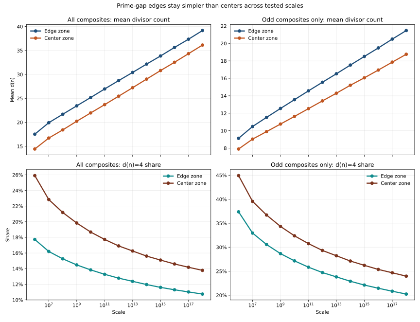
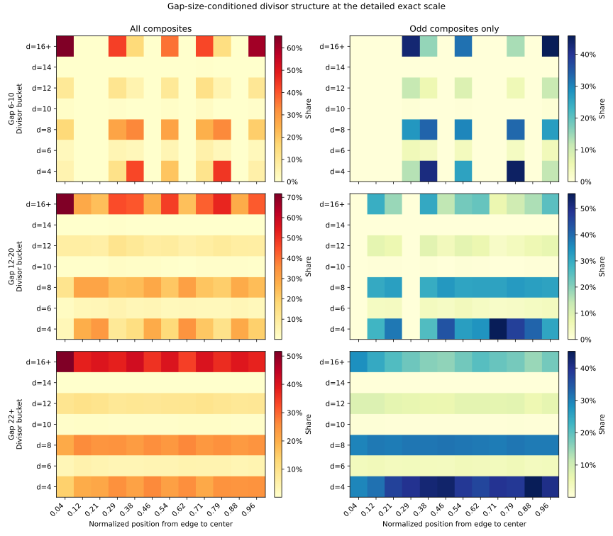

# Broad Prime-Edge Insulation Is Falsified

This note records the outcome of the direct validation campaign against the
strong claim that prime-gap edges form a general low-complexity insulation zone
while gap centers form a high-complexity graveyard.

## Finding

That broad claim is falsified on the current committed execution surface.

Across exact `10^6`, exact `10^7`, and sampled larger-scale regimes through
`10^18`, the literal edge zone is not globally simpler than the center zone.

Instead, the tested edge zone shows:

- higher mean divisor count than the center zone,
- lower `d(n)=4` share than the center zone,
- higher high-divisor share than the center zone.

This remains true in the odd-composite control and in the tested gap-size bins.

## Visual Evidence

Artifacts:

- [validation_summary_panel.svg](../../benchmarks/output/python/gap_ridge/composite_structure_validation/validation_summary_panel.svg)
- [validation_detail_panel.svg](../../benchmarks/output/python/gap_ridge/composite_structure_validation/validation_detail_panel.svg)
- [validation_gap_bin_heatmaps.svg](../../benchmarks/output/python/gap_ridge/composite_structure_validation/validation_gap_bin_heatmaps.svg)
- [validation_results.json](../../benchmarks/output/python/gap_ridge/composite_structure_validation/validation_results.json)

## Plain Reading

The broad insulation picture does not survive direct testing.

What survives is narrower:

- the raw-`Z` winner is still strongly pulled toward the first odd interior
  positions,
- the ridge is still strongly associated with low-divisor carriers,
- but the full edge band is not a general low-complexity zone.
