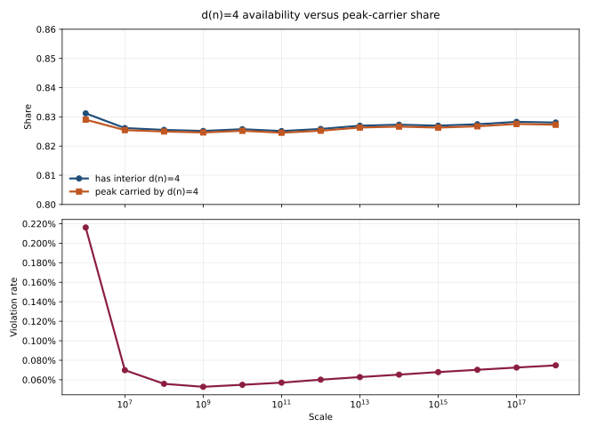

# d(n)=4 Carrier Dominance Is Availability-Driven

This note records the finding that most of the observed `d(n)=4` carrier
dominance is explained by whether a gap contains any interior `d(n)=4`
composite at all.

## Finding

The promising core of the "d(n)=4 inevitability threshold" insight is correct
in a narrow form:

`d(n)=4` peak-carrier dominance tracks `d(n)=4` availability inside the gap
almost one-for-one.

Measured values:

- `10^6`: has interior `d(n)=4` = `0.83119`, peak carrier `d(n)=4` = `0.82903`
- `10^7`: has interior `d(n)=4` = `0.82616`, peak carrier `d(n)=4` = `0.82546`
- `10^8` sampled: has interior `d(n)=4` = `0.82554`, peak carrier `d(n)=4` = `0.82498`
- `10^10` sampled: has interior `d(n)=4` = `0.82577`, peak carrier `d(n)=4` = `0.82522`
- `10^12` sampled: has interior `d(n)=4` = `0.82695`, peak carrier `d(n)=4` = `0.82627`
- `10^15` sampled: has interior `d(n)=4` = `0.82699`, peak carrier `d(n)=4` = `0.82631`
- `10^18` sampled: has interior `d(n)=4` = `0.82805`, peak carrier `d(n)=4` = `0.82730`

That is the current committed execution surface for this note through sampled
`10^18`.

## Visual Evidence

Artifacts:

- [d4_availability_vs_peak_share.svg](../../benchmarks/output/python/gap_ridge/insight_probes/d4_availability_vs_peak_share.svg)
- [d4_availability_vs_peak_share.json](../../benchmarks/output/python/gap_ridge/insight_probes/d4_availability_vs_peak_share.json)

## Residual Exception

The near-equivalence is not exact.

There is a small exception family in which a gap contains interior `d(n)=4`
but the peak is not carried by `d(n)=4`. On the tested surface, those
exceptions are odd squares with `d(n)=3`, such as `9`, `25`, `49`, and `121`.

The exception rate is tiny:

- `10^6`: `0.216%`
- `10^7`: `0.0698%`
- `10^8`: `0.0558%`
- `10^10`: `0.0548%`
- `10^12`: `0.0689%`
- `10^15`: `0.0679%`
- `10^18`: `0.0748%`

## Plain Reading

Most of the reported `d(n)=4` carrier dominance is really telling us whether
the gap contains an interior semiprime-class candidate.

That makes the dominance mostly an availability law, with a thin square-driven
exception set.
