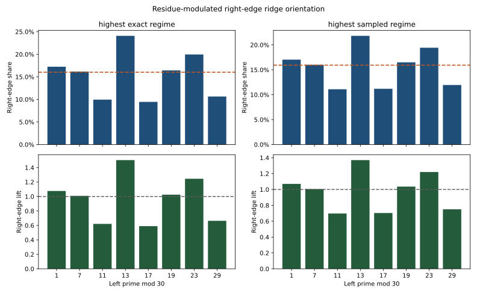

# Residue-Modulated Ridge Orientation

This note records one arithmetic refinement of the gap-ridge result.

## Finding

The orientation of the near-edge ridge depends materially on the residue class
of the left endpoint prime modulo `30`.

That residue label does not mention gap interiors or raw-`Z` values, but it
still changes how often the right edge carries the within-gap maximum.

The tested data support modulation, not inversion.

## Visual Evidence

Artifacts:

- [residue_mod30_right_edge_share.svg](../../benchmarks/output/python/gap_ridge/insight_probes/residue_mod30_right_edge_share.svg)
- [residue_mod30_right_edge_share.json](../../benchmarks/output/python/gap_ridge/insight_probes/residue_mod30_right_edge_share.json)

## Measured Surface

At exact `10^7`:

- global right-edge share: `16.02%`
- `p ≡ 13 (mod 30)`: right-edge share `24.08%`, lift `1.50x`
- `p ≡ 23 (mod 30)`: right-edge share `19.96%`, lift `1.25x`
- `p ≡ 11 (mod 30)`: right-edge share `9.95%`, lift `0.62x`
- `p ≡ 17 (mod 30)`: right-edge share `9.45%`, lift `0.59x`

At sampled `10^18`:

- global right-edge share: `15.93%`
- `p ≡ 13 (mod 30)`: right-edge share `21.82%`, lift `1.37x`
- `p ≡ 23 (mod 30)`: right-edge share `19.43%`, lift `1.22x`
- `p ≡ 11 (mod 30)`: right-edge share `11.09%`, lift `0.70x`
- `p ≡ 17 (mod 30)`: right-edge share `11.19%`, lift `0.70x`

That is the current committed execution surface for this note through sampled
`10^18`.

## Plain Reading

The near-edge ridge is not one universal shape.

It is better described as a family of residue-conditioned ridge orientations.
Some left-prime residue classes make right-edge wins materially more common,
while others reinforce strong left-edge dominance.
