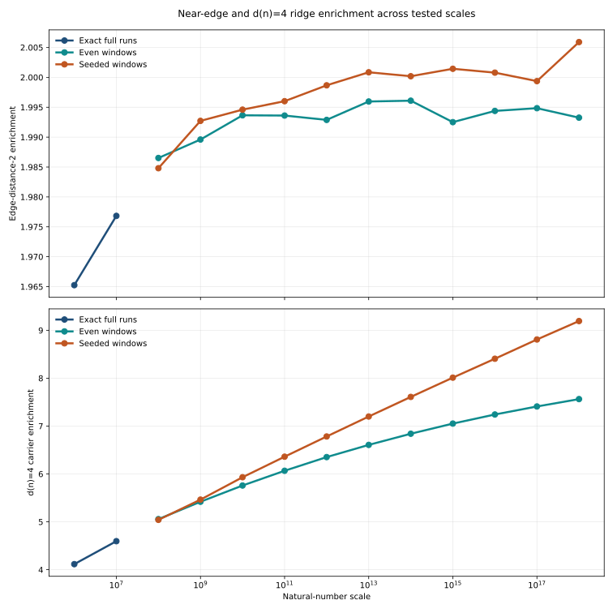
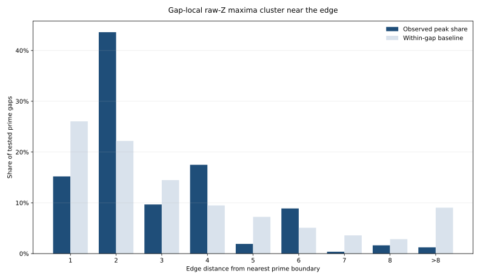
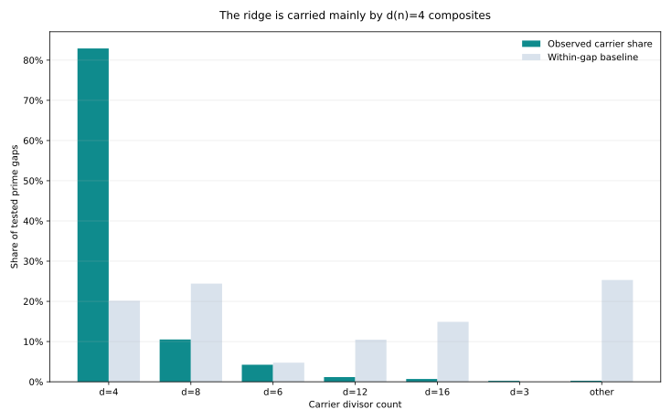
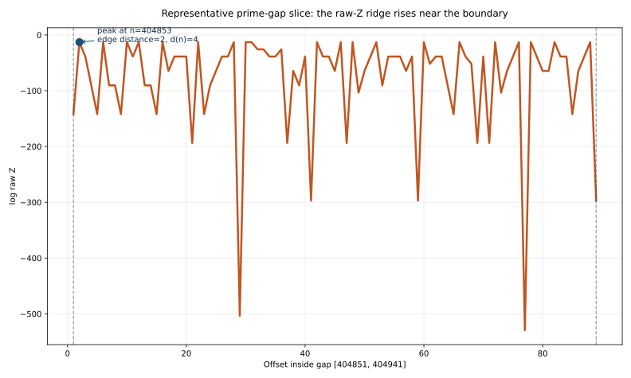
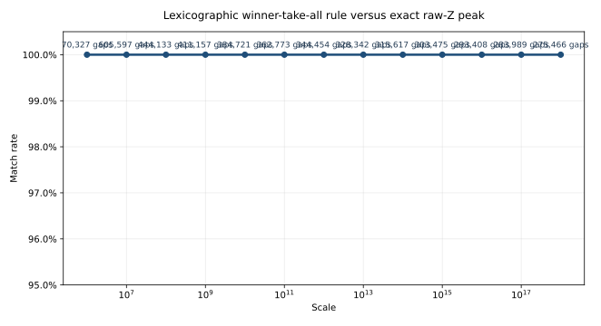

# Exact Raw Composite Z Field: Figure Note

This note collects the rendered figures for the exact raw composite `Z` gap-edge study and states the empirical result directly.

The figures are generated from:

- `benchmarks/output/python/gap_ridge/raw_z_gap_edge/raw_z_gap_edge_run_all.json`
- `benchmarks/python/gap_ridge/raw_z_gap_edge_plots.py`

## Main Result

Across the tested regimes, the exact raw composite field
$$
Z(n) = n^{1 - d(n)/2}
$$
does not place the strongest within-gap composite near the midpoint of a prime gap.

It places that peak on a near-edge ridge, and that ridge is carried predominantly by `d(n) = 4` composites.

The strongest supported statement from the current committed runs is:

- edge-distance-`2` enrichment stays near `2x` from the exact `10^6` run through sampled `10^18` windows,
- the `d(n) = 4` carrier enrichment strengthens with scale, rising from `4.116x` at `10^6` to about `7.56x` in even-window `10^18` runs and about `9.19x` in fixed-seed `10^18` runs,
- the left edge remains the dominant side of the ridge throughout the tested regimes.

On the tested surface, a stronger empirical statement also holds: the exact
raw-`Z` peak matches the lexicographic winner obtained by first minimizing
interior divisor count and then taking the leftmost carrier of that minimum.

## Regime Confirmation

This figure shows that the edge-distance-`2` enrichment remains stable near `2x`, while the `d(n) = 4` carrier enrichment strengthens as the scale increases.



## Peak Position by Edge Distance

This figure compares the observed location of the gap-local raw-`Z` maximum against the exact within-gap baseline. The observed peak mass is concentrated much closer to the prime boundaries than baseline predicts.



## Carrier Divisor Count

This figure compares the divisor count of the composite carrying the gap-local raw-`Z` maximum against the exact within-gap baseline. The ridge is overwhelmingly carried by `d(n) = 4` composites rather than by the generic within-gap divisor mix.



## Representative Gap Slice

This figure shows one exact prime-gap slice from the `10^6` regime. The profile is not midpoint-centered. The local maximum rises close to the boundary at an edge distance of `2`, and the peak carrier is a `d(n) = 4` composite.



## 3D Edge-Distance Enrichment Surface

This figure resolves the same effect over two variables at once: gap size and edge distance. The elevated surface sits on the low edge-distance side rather than over the center.


## 3D Carrier Enrichment Surface

This figure resolves the carrier effect over gap size and divisor count. The dominant high surface is the `d(n) = 4` carrier band.


## Lexicographic Validation

This figure records the direct counterexample search for the lexicographic peak
rule. On the current committed execution surface, the match rate is `100%` in
every evaluated regime from exact `10^6` through sampled `10^18`.



## Reproduction

Run:

```bash
python3 benchmarks/python/gap_ridge/raw_z_gap_edge_run_all.py \
  > benchmarks/output/python/gap_ridge/raw_z_gap_edge/raw_z_gap_edge_run_all.json

python3 benchmarks/python/gap_ridge/raw_z_gap_edge_plots.py

python3 benchmarks/python/gap_ridge/lexicographic_peak_validation.py
```
