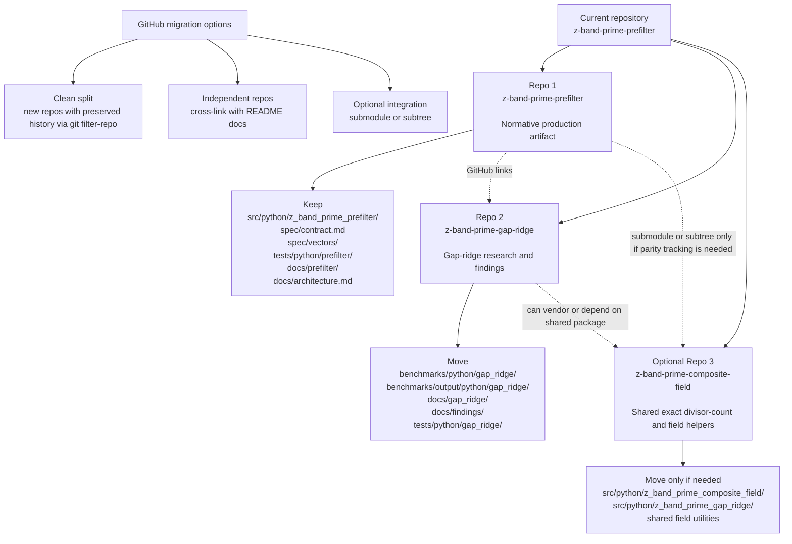

# Repository Split Diagram

## Plain Reading

- `Repo 1` stays narrow and remains the normative production implementation.
- `Repo 2` becomes the research surface for the gap-ridge program and findings.
- `Repo 3` is optional and only worth creating if the exact composite-field code
  becomes a genuinely shared dependency rather than just internal research code.

## Recommended First Split

Start with two repos, not three:

1. `z-band-prime-prefilter`
2. `z-band-prime-gap-ridge`

Only split out a shared divisor-count/core repo later if both repos actually need to
version that code independently.
