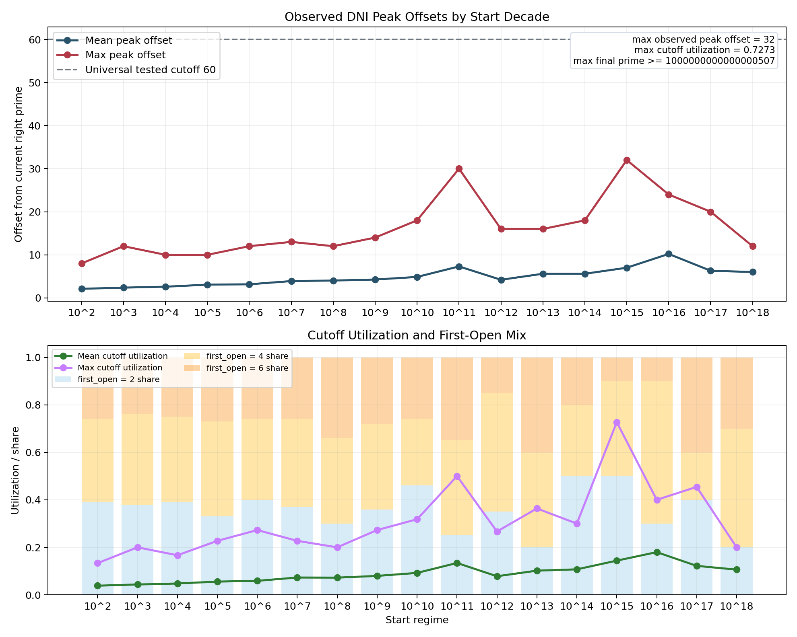

# Exact DNI/GWR Recursive Prime Walk

This note records the current predictor state honestly.

The predictor line now has two distinct layers:

- an unbounded DNI/GWR next-gap oracle that is exact by construction;
- a bounded dynamic cutoff walker that compresses the oracle to a finite scan
  and is empirical rather than proved.

The result is implemented in:

- [`gwr_dni_direct_rule_probe.py`](../../../benchmarks/python/predictor/gwr_dni_direct_rule_probe.py)
- [`gwr_dni_recursive_walk.py`](../../../benchmarks/python/predictor/gwr_dni_recursive_walk.py)
- [`gwr_dni_recursive_gap_scaling_sweep.py`](../../../benchmarks/python/predictor/gwr_dni_recursive_gap_scaling_sweep.py)
- [`plot_gwr_dni_recursive_gap_scaling_sweep.py`](../../../benchmarks/python/predictor/plot_gwr_dni_recursive_gap_scaling_sweep.py)

The strongest supported claims are concrete:

- the unbounded DNI/GWR transition is exact by construction at any scale;
- on the combined exact $10^6 + 10^7$ transition surface, the DNI transition
  rule predicts the immediate next gap state with exact rate $1.0$ on
  $743{,}075$ rows;
- on the exact recursive walk from prime $11$ through prime $10{,}000{,}121$,
  the algorithm records $664{,}578$ exact consecutive next-prime recoveries
  with zero skipped gaps;
- on the sampled decade ladder from $10^2$ through $10^18$, the exact walk
  remains at hit rate $1.0$ with zero skipped gaps across $860$ measured
  recursive steps;
- the fixed cutoff map `{2:44, 4:60, 6:60}` is false;
- the current dynamic cutoff `C(q) = max(64, ceil(0.5 * log(q)^2))` is
  certified on the committed exact consecutive-right-prime surface through
  `q <= 10^7`.

This is not yet a closed-form formula for $p_n$. The unconditional part is a
sequential next-prime oracle: given one known prime, it recovers the immediate
next prime by scanning the full next-gap interior and then applying one
witness lookup. The bounded walker is a finite empirical compression of that
oracle.

The mechanism now has a clean split:

- the unbounded DNI/GWR transition is exact by construction, because it scans
  the full next-gap interior and takes the lexicographic divisor minimum before
  the first prime endpoint;
- the current bounded walker uses a dynamic log-squared cutoff rather than the
  falsified fixed `44/60` map.

So the remaining open theorem question is not whether the mechanism itself can
be exact. It is whether the dynamic bounded compression always recovers the
same next-gap lex-min as the unbounded reference beyond the current certified
finite surface.

## 1. Setting

Let $q$ be a known prime and let $q^+$ be the immediate next prime. Write
$d(n)$ for the divisor count of $n$.

The next-gap transition problem is:

1. recover the minimum interior divisor class in the gap $(q, q^+)$;
2. recover the first offset where that minimum occurs;
3. use that divisor class to recover $q^+$ exactly.

The witness map already existed in the project:

$$
W_\delta(x) = \min\{n \ge x : n \text{ composite and } d(n) = \delta\}.
$$

Once the correct next-gap minimum divisor class $\delta(q)$ is known, the
recovery step is exact on the tested surface:

$$q^+ = nextprime(W_{\delta(q)}(q+1) - 1).$$

So the remaining problem was not witness recovery. The remaining problem was
the transition law for the immediate next gap.

## 2. The 12-Step Rule and Its Failure Surface

The earlier direct rule looked only at the first $12$ offsets to the right of
$q$:

$$
\Pi_{12}(q) = \big(d(q+1), d(q+2), \dots, d(q+12)\big).
$$

Among the composite offsets in that prefix, it chose the lexicographic minimum:
the smallest divisor count, with ties broken by earliest offset.

On the combined exact $10^6 + 10^7$ surface, that rule was already extremely
strong:

- rows: $743{,}075$;
- exact predictions: $738{,}741$;
- exact rate: $0.9941674797295024$;
- residual miss count: $4{,}334$.

Those misses were not random. They were continuation misses. The correct next
gap minimum was not contradicted inside the first $12$ offsets. It simply lay
farther to the right.

The observed residual miss target counts were:

| actual next-gap minimum divisor class | count |
|---|---:|
| $4$ | $4{,}077$ |
| $3$ | $158$ |
| $6$ | $99$ |

The observed residual miss offsets were concentrated at:

| offset | count |
|---|---:|
| $14$ | $1{,}930$ |
| $16$ | $745$ |
| $18$ | $497$ |
| $15$ | $424$ |
| $13$ | $375$ |

So the failure mode was not that the first $12$ offsets produced the wrong
local structure. The failure mode was that the correct first minimum-divisor integer
often appeared just beyond the prefix.

## 3. Exact Oracle and Dynamic Compression

There are now two related transition laws in the repository.

The unconditional reference law is:

1. start at $q+1$,
2. read exact divisor counts until the first prime endpoint appears,
3. over the composite offsets before that endpoint, take the lexicographic
   minimum.

That rule is exact by construction.

### 3.1 Dynamic Cutoff

The current bounded compression is

$$C(q) = \max(64, \lceil 0.5 \cdot \log(q)^2 \rceil).$$

This is an empirical replacement for the earlier fixed cutoff map
`{2:44, 4:60, 6:60}`.

### 3.2 Why the Fixed Map Was Removed

The fixed theorem is false. The committed counterexample is:

- current right prime `q = 24,098,209`
- next prime `q^+ = 24,098,287`
- square branch interior point `4909^2 = 24,098,281`
- exact square offset `72`

So the old `60` branch fails directly.

### 3.3 Operational Rule

For a known prime $q$:

1. Compute the dynamic cutoff $C(q)$.
2. Scan offsets $1$ through $12$, reading divisor counts $d(q+k)$.
3. If a prime appears inside that prefix, the gap closes inside the prefix.
   Return the lexicographic minimum over the composite offsets already seen.
4. Otherwise let $(\delta,\omega)$ be the lexicographic minimum over offsets
   $1$ through $12$.
5. If $\delta \le 3$, stop. No later composite can have a smaller divisor
   class.
6. Otherwise continue scanning offsets $13$ through $C(q)$.
   Stop at the first prime encountered. Over the composite offsets seen before
   that prime, keep the lexicographic minimum.
7. Return the resulting pair $(\delta(q), \omega(q))$.

Written more compactly, the algorithm computes the lexicographic minimum over
the composite interior of the next gap, but does so without prior knowledge of
the next prime. The first prime encountered during the scan marks the right
endpoint of the gap.

The resulting next prime is then recovered by:

$$q^+ = nextprime(W_{\delta(q)}(q+1)-1).$$

### 3.4 Canonical Falsification Instruments

The repository now contains two direct instruments for the bounded layer.

The compare harness is
[`gwr_dni_cutoff_counterexample_scan.py`](../../../benchmarks/python/predictor/gwr_dni_cutoff_counterexample_scan.py).
It iterates consecutive prime gaps in increasing right-prime order and
compares:

- the bounded dynamic cutoff rule;
- the exact unbounded reference transition.

Its contract is narrow:

- if one mismatch appears, the bounded law is false and the first
  counterexample is recorded;
- if no mismatch appears on a finite surface, the scan certifies exactly that
  finite surface and emits the frontier verification records that any larger claim must
  explain.

On the current committed scan through `q <= 10^7`, the exact compare surface
reports:

- tested gaps: `664,575`;
- first tested right prime: `11`;
- last tested right prime: `9,999,991`;
- first counterexample: `none`;
- maximum exact peak offset: `60`;
- maximum cutoff utilization: `0.6153846153846154`.

The square branch now has two direct instruments:

- the archived fixed-vs-dynamic audit
  [`square_branch_gap_audit.py`](../../../benchmarks/python/predictor/square_branch_gap_audit.py);
- the direct dynamic-cutoff search
  [`square_branch_dynamic_cutoff_search.py`](../../../benchmarks/python/predictor/square_branch_dynamic_cutoff_search.py).

The retained direct square search through `p <= 10^8` is:

- [../../../output/gwr_proof/square_branch_dynamic_cutoff_search_1e8/square_branch_dynamic_cutoff_search_summary.json](../../../output/gwr_proof/square_branch_dynamic_cutoff_search_1e8/square_branch_dynamic_cutoff_search_summary.json)
- [../../../output/gwr_proof/square_branch_dynamic_cutoff_search_1e8/square_branch_dynamic_cutoff_search_frontier.csv](../../../output/gwr_proof/square_branch_dynamic_cutoff_search_1e8/square_branch_dynamic_cutoff_search_frontier.csv)

That search tested `5,761,454` odd prime squares, found no dynamic-cutoff
counterexample on that finite surface, and recorded maximum square-branch
utilization `0.8120300751879699` at

- `p = 82,357,433`,
- `q = prevprime(p^2) = 6,782,746,770,348,949`,
- square offset `540`,
- dynamic cutoff `665`.

## 4. Exactness on the Verified Surface

### 4.1 Transition Surface

The exact transition surface was built by
[`gwr_dni_transition_probe.py`](../../../benchmarks/python/predictor/gwr_dni_transition_probe.py)
and re-evaluated by
[`gwr_dni_direct_rule_probe.py`](../../../benchmarks/python/predictor/gwr_dni_direct_rule_probe.py).

On the combined exact $10^6 + 10^7$ surface:

| rule | exact rows | total rows | exact rate |
|---|---:|---:|---:|
| 12-step DNI lex-min | $738{,}741$ | $743{,}075$ | $0.9941674797295024$ |
| extended DNI lex-min | $743{,}075$ | $743{,}075$ | $1.0$ |

So the bounded extension removes every known miss on that full exact surface.
That exact transition surface is the current committed certification surface
for the bounded rule.

### 4.2 Exact Recursive Walk

The recursive walk script is
[`gwr_dni_recursive_walk.py`](../../../benchmarks/python/predictor/gwr_dni_recursive_walk.py).

Its verified long walk starts at gap index $4$, which is the gap $(7,11)$, and
advances only through its own predicted next primes. On the tested run:

| start gap | steps | final prime | exact hits | skipped gaps |
|---|---:|---:|---:|---:|
| $(7,11)$ | $664{,}578$ | $10{,}000{,}121$ | $664{,}578$ | $0$ |

This means the walk is not merely exact on isolated one-step probes. It stays
exact while feeding its own output forward over a long consecutive chain.

## 5. Sampled Scaling Through $10^{18}$

The scaling sweep is
[`gwr_dni_recursive_gap_scaling_sweep.py`](../../../benchmarks/python/predictor/gwr_dni_recursive_gap_scaling_sweep.py).

It starts at the first prime at or above each decade input prime $10^m$ and runs a
deterministic exact walk budget in that regime:

- $100$ steps for $10^2$ through $10^7$,
- $50$ steps for $10^8$ through $10^{10}$,
- $20$ steps for $10^{11}$ through $10^{13}$,
- $10$ steps for $10^{14}$ through $10^{18}$.

Across all $17$ decade regimes:

| quantity | value |
|---|---:|
| total measured recursive steps | $860$ |
| mean exact hit rate | $1.0$ |
| mean skipped gaps | $0.0$ |
| all exact hits | `true` |
| all zero skips | `true` |
| max observed peak offset | $32$ |
| max observed cutoff utilization | $0.1875$ |
| max runtime per regime | $39.371231416007504$ s |
| mean runtime per step | $0.31360285915989045$ s |

Selected decade rows are:

| start regime | steps | start right prime | final predicted prime | max peak offset | max cutoff utilization | exact hit rate |
|---|---:|---:|---:|---:|---:|---:|
| $10^2$ | $100$ | $101$ | $701$ | $8$ | $0.125$ | $1.0$ |
| $10^7$ | $100$ | $10{,}000{,}019$ | $10{,}001{,}687$ | $13$ | $0.1$ | $1.0$ |
| $10^{10}$ | $50$ | $10{,}000{,}000{,}019$ | $10{,}000{,}001{,}113$ | $18$ | $0.06766917293233082$ | $1.0$ |
| $10^{13}$ | $20$ | `10000000000037` | `10000000000657` | $16$ | $0.035634743875278395$ | $1.0$ |
| $10^{16}$ | $10$ | `10000000000000061` | `10000000000000753` | $24$ | $0.035346097201767304$ | $1.0$ |
| $10^{18}$ | $10$ | `1000000000000000003` | `1000000000000000507` | $12$ | $0.013969732246798603$ | $1.0$ |

The deepest sampled regime is especially important:

- start right prime: `1000000000000000003`;
- steps: $10$;
- exact hit rate: $1.0$;
- skipped gaps: $0$;
- final predicted prime: `1000000000000000507`.

## 6. Figures

Figure 1 shows the exactness and runtime surface across the decade ladder. The
exact hit rate stays pinned at $1.0$ and the skipped-gap count stays pinned at
$0.0$ across the full sampled range.


Figure 2 shows the observed peak offsets and the fraction of the tested cutoff
window actually used on the sampled recursive walk. This figure is a walker
diagnostic, not a proof of the bounded compression. The real pressure test for
the compression layer is the compare mode and the square-branch audit.



## 7. Interpretation

The result changes the status of the predictor program.

Before this step, the project had:

- an exact witness recovery law once the right divisor class was known;
- a very strong but imperfect 12-step local transition rule;
- a recursive walk that could jump ahead.

After this step, on the tested surface, the project now has:

- an exact local next-gap transition rule;
- an exact local next-prime recovery rule;
- a no-skip sequential prime walk.

So the remaining open problem is no longer whether the DNI/GWR mechanism can
support an exact next-prime walk. On the tested surface, it does.

The remaining open problem is narrower:

- whether the dynamic bounded cutoff
  $C(q) = \max(64, \lceil 0.5 \cdot \log(q)^2 \rceil)$ is universal,
- or whether the coefficient `0.5` eventually needs to grow.

The new counterexample scan is therefore the canonical theorem test:

- the unbounded transition is the exact reference,
- the bounded rule is the conjectured compression,
- the scan decides whether the compression survives each tested surface.

## 8. What This Does and Does Not Claim

This note supports the following claims:

- there is an exact deterministic DNI/GWR next-prime oracle in the repository;
- there is an empirical bounded compression layer in the repository;
- that bounded layer is certified on the committed exact surface through
  `q <= 10^7`;
- there is a built-in compare mode that can falsify that compression directly.

This note does not support the following stronger claims:

- a proof that the current dynamic cutoff is sufficient at all larger primes;
- a direct closed-form expression for $p_n$ as a function of $n$ alone.

So the correct present description is:

- exact deterministic sequential generator on the tested surface;
- unconditional exact transition mechanism in unbounded form;
- dynamic bounded walker certified through the committed exact surface
  `q <= 10^7`;
- dynamic square-branch audit through `p <= 10^6` with `7,477` archived fixed-
  cutoff violations and full dynamic-cutoff coverage on that audit surface;
- not yet an unconditional all-scale theorem for the compression layer;
- not yet a direct $n \mapsto p_n$ closed form.

## 9. Reproduction

The main commands are:

```bash
python3 benchmarks/python/predictor/gwr_dni_direct_rule_probe.py \
  --train-detail-csv /tmp/gwr_dni_transition_probe_1e6_minimal/gwr_dni_transition_probe_details.csv \
  --test-detail-csv /tmp/gwr_dni_transition_probe_1e7_minimal_fast/gwr_dni_transition_probe_details.csv \
  --output-json /tmp/gwr_dni_direct_rule_probe_summary.json
```

```bash
python3 benchmarks/python/predictor/gwr_dni_recursive_walk.py \
  --start-gap-index 4 \
  --steps 664578 \
  --output-dir /tmp/gwr_dni_recursive_walk_full
```

```bash
python3 benchmarks/python/predictor/gwr_dni_recursive_gap_scaling_sweep.py \
  --min-power 2 \
  --max-power 18 \
  --output-dir /tmp/gwr_dni_recursive_gap_scaling_2_to_18
```

```bash
python3 benchmarks/python/predictor/square_branch_gap_audit.py \
  --max-prime 1000000 \
  --output-dir /tmp/square_branch_audit_1e6
```

```bash
python3 benchmarks/python/predictor/square_branch_dynamic_cutoff_search.py \
  --min-prime 3 \
  --max-prime 100000000 \
  --output-dir /tmp/square_branch_dynamic_cutoff_search_1e8
```

```bash
python3 benchmarks/python/predictor/gwr_dni_cutoff_counterexample_scan.py \
  --min-right-prime 11 \
  --max-right-prime 10000000 \
  --output-dir /tmp/gwr_dni_cutoff_counterexample_scan_1e7
```

```bash
python3 benchmarks/python/predictor/plot_gwr_dni_recursive_gap_scaling_sweep.py \
  --input-dir /tmp/gwr_dni_recursive_gap_scaling_2_to_18 \
  --output-dir /tmp/gwr_dni_recursive_gap_scaling_2_to_18/plots
```

Focused validation for the new exact walk and scaling surface is:

```bash
pytest -q \
  tests/python/predictor/test_gwr_dni_direct_rule_probe.py \
  tests/python/predictor/test_gwr_dni_cutoff_counterexample_scan.py \
  tests/python/predictor/test_gwr_dni_recursive_walk.py \
  tests/python/predictor/test_gwr_dni_recursive_gap_scaling_sweep.py
```
