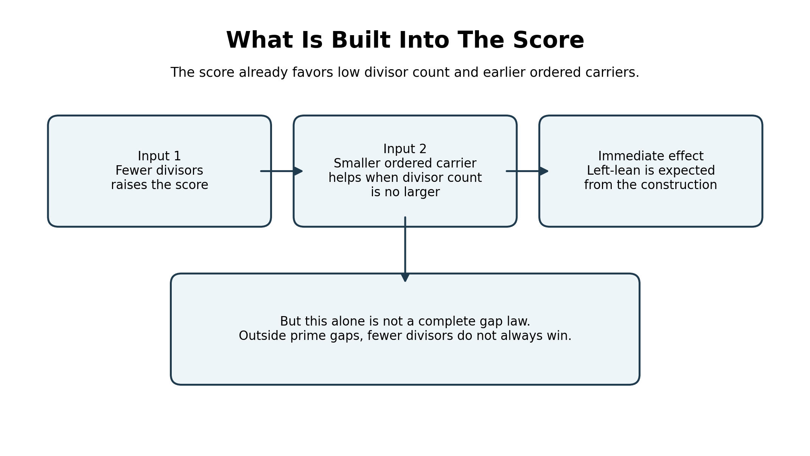
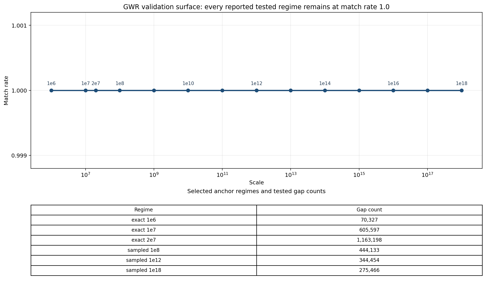
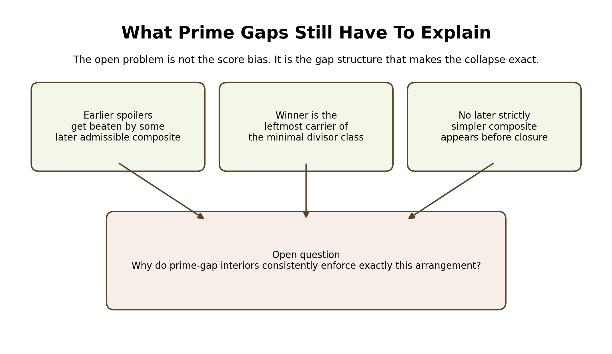

# What Is Built In, And What Prime Gaps Still Have To Explain

When someone first sees the Leftmost Minimum-Divisor Rule, the natural pushback is that the
score already prefers numbers with fewer divisors and earlier position, so the
result should not be very surprising. That criticism gets one thing right and
one thing wrong. It is right that taking the log does not create a second
maximizer rule. The log and the raw score pick the same point. But that does not
mean the full collapse inside prime gaps is automatic.

---

If the whole rule were already built into the score, then the same maximizer rule
would hold on arbitrary ordered composite sets. It does not. The pair forty-
nine and six is the clean obstruction. Forty-nine has fewer divisors than six,
but it still loses on the score. So the score does not simply say “fewest
divisors always wins.” Something more specific has to be true inside prime
gaps.

---

That is where the actual prime-gap result begins. Inside tested prime gaps, the
score maximizer and the leftmost integer with the smallest divisor count present in
the gap land on the same integer. This is not a vague tendency. It is an exact
identity on the tested surfaces. The local gap pictures already show the
collapse directly, and the broader validation surface shows that it stays exact
as the scale grows.

---

So the real theorem is not “the score prefers simpler numbers.” That part is
elementary. The real theorem is that prime-gap interiors appear always to
organize themselves so that every earlier competing integer gets beaten by some later
admissible composite, while nothing strictly simpler appears after the selected integer
before the gap closes. That extra organization is what turns a directional bias
into a complete maximizer rule.

---

That is the actual open question. Not why the score leans left in a loose
sense, but why prime gaps seem to enforce exactly the local structure needed
for the collapse to be complete.

