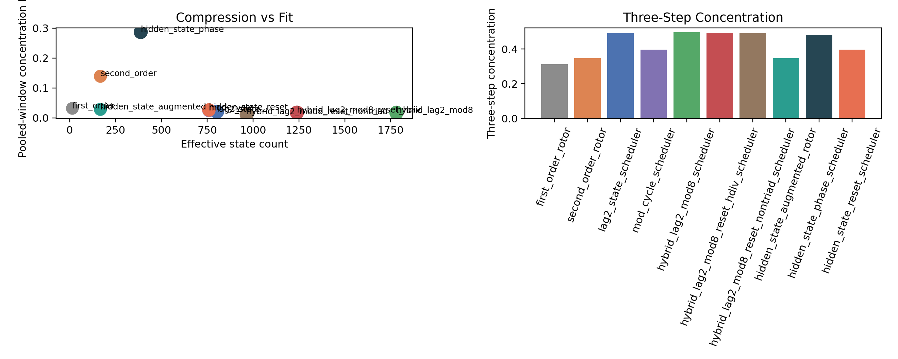

# Compression Shock Probe Findings

The smallest model that clears the compression rule is `hidden_state_augmented_rotor` with pooled-window concentration L1 `0.0284` and three-step concentration `0.3479`.

This is real compression, not just machine bloat.

## Upstream Hidden State

- candidate id: `current_winner_parity+previous_reduced_state`
- source commit: `55858ba4b84f13724c904e6994b91cbf0a4e3d87`

## Frontier

- `first_order_rotor`: states `14`, pooled L1 `0.0317`, three-step `0.3114`
- `hidden_state_augmented_rotor`: states `167`, pooled L1 `0.0284`, three-step `0.3479`
- `hidden_state_phase_scheduler`: states `387`, pooled L1 `0.2867`, three-step `0.4797`
- `mod_cycle_scheduler`: states `759`, pooled L1 `0.0249`, three-step `0.3957`
- `lag2_state_scheduler`: states `803`, pooled L1 `0.0201`, three-step `0.4900`
- `hybrid_lag2_mod8_reset_nontriad_scheduler`: states `965`, pooled L1 `0.0116`, three-step `0.4907`
- `hybrid_lag2_mod8_reset_hdiv_scheduler`: states `1239`, pooled L1 `0.0174`, three-step `0.4929`
- `hybrid_lag2_mod8_scheduler`: states `1782`, pooled L1 `0.0172`, three-step `0.4966`

## Artifacts

- [compression shock probe script](../../benchmarks/python/predictor/gwr_compression_shock_probe.py)
- [summary JSON](../../output/gwr_compression_shock_probe_summary.json)
- [model CSV](../../output/gwr_compression_shock_probe_models.csv)
- [history JSONL](../../output/gwr_compression_shock_probe_history.jsonl)
- 
