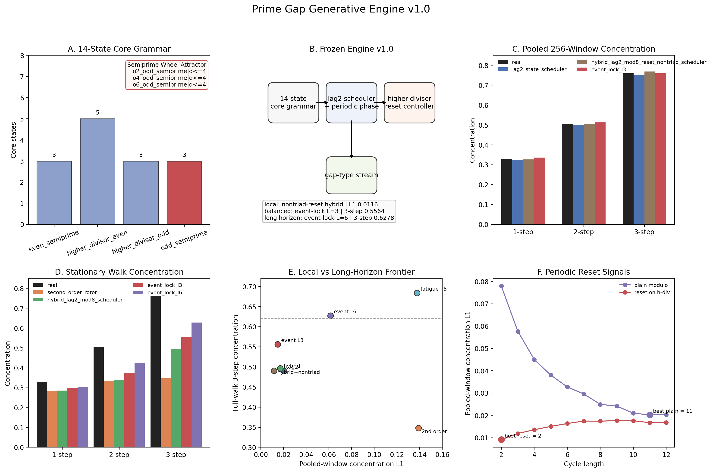

# GWR Gap-Type Engine v1.0 Freeze

The strongest supported result is now concrete:

On the persistent `14`-state reduced gap-type surface, the Prime Gap
Generative Engine is frozen as a deterministic three-layer engine with a core
grammar, a scheduler, and a higher-divisor-triggered long-horizon controller.

This is an operational freeze, not a claim that every layer is finished in the
same sense. The local engine is already very tight. The long-horizon layer is
now a measured frontier with stable reference profiles.

The synthesis artifacts are:

- [../../output/gwr_dni_gap_type_engine_v1_summary.json](../../output/gwr_dni_gap_type_engine_v1_summary.json)
- 

## Frozen Object

The frozen engine has three layers.

1. **Core grammar**: a persistent `14`-state reduced alphabet built on
   `open_family|d_bucket`.
2. **Scheduler layer**: a lag-2 transition law with a small periodic phase.
3. **Long-horizon controller**: a deterministic reset mechanism triggered by
   higher-divisor events.

The dominant dynamical object inside the core is the triad

- `o2_odd_semiprime|d<=4`
- `o4_odd_semiprime|d<=4`
- `o6_odd_semiprime|d<=4`

We keep the name **Semiprime Wheel Attractor** for that triad.

## Frozen Profiles

The engine is frozen with three reference operating profiles rather than one
pretend-universal setting.

### Local Fidelity Profile

The best local profile is:

- model: `hybrid_lag2_mod8_reset_nontriad_scheduler`
- pooled-window concentration L1: `0.0116`
- pooled concentrations: `0.3269 / 0.5057 / 0.7692`
- full-walk three-step concentration: `0.4907`

This is the best current local closure. It is the right profile for short
window explanation, local comparison, and the main “engine closes the observed
window surface” claim.

### Balanced Frontier Profile

The best balanced profile is:

- controller: event-lock
- lock length: `L = 3`
- pooled-window concentration L1: `0.0150`
- pooled concentrations: `0.3357 / 0.5127 / 0.7603`
- full-walk three-step concentration: `0.5564`

This is the cleanest single profile when one wants both a near-closed local
surface and a materially sharper stationary walk.

### Long-Horizon Study Profile

The best current long-horizon study profile is:

- controller: event-lock
- lock length: `L = 6`
- pooled-window concentration L1: `0.0614`
- full-walk three-step concentration: `0.6278`

This is not the best local profile. It is the profile that clears the
stationary `0.62` threshold while staying within the same deterministic engine
family.

## Why The Freeze Uses Three Profiles

The present frontier is part of the result.

The local surface and the stationary million-step walk are not closed by the
same controller setting. That is exactly what one expects if the engine has a
fast layer and a slower re-entry law rather than a single flat rotor.

At the moment:

- the local engine closes best with the nontriad-reset hybrid;
- the best balanced profile is event-lock `L = 3`;
- the best stationary profile is event-lock `L = 6`;
- the fatigue controller can drive stationary concentration even higher, up to
  `0.6840`, but it distorts the local surface too much to be the frozen
  reference profile.

So the freeze is honest:

The engine is operationally complete as a deterministic research instrument,
and the remaining open problem is not whether the engine exists, but what
single long-horizon law, if any, can dominate both local and stationary
objectives at once.

## Periodic Reset Signals

The periodic layer is also frozen in its current measured form.

- operating hybrid cycle: `8`
- best plain modulo cycle in the tested reduced sweep: `11`
- best higher-divisor reset cycle in the tested reduced sweep: `2`

So the right current statement is:

There is a real small periodic controller on the reduced surface, but the
current evidence does not privilege `8` as a unique arithmetic law. The frozen
engine therefore keeps `8` as the working hybrid phase while recording `11`
and `2` as the strongest competing periodic signals on the current sweep.

## Record Reset Signature

The higher-divisor reset trigger also survives the record-gap readout.

Using the balanced frontier window (`L = 3`):

- all records with a recent higher-divisor event: `0.4961`
- maximal records with a recent higher-divisor event: `0.5833`

Using the long-horizon study window (`L = 6`):

- all records with a recent higher-divisor event: `0.7674`
- maximal records with a recent higher-divisor event: `0.7917`

This is not yet a full maximal-gap mechanism. It is a real enrichment signal
that fits the long-horizon reset reading.

## Current Claim

The current engine claim is:

On the persistent reduced gap-type surface, prime-gap types are generated by a
hierarchical finite-state engine with a `14`-state core grammar, a scheduler
layer, and a higher-divisor-triggered long-horizon controller frontier.

What remains outside the freeze is narrower:

No single tested deterministic controller yet achieves both pooled-window
concentration L1 below `0.015` and full-walk three-step concentration above
`0.62`.
