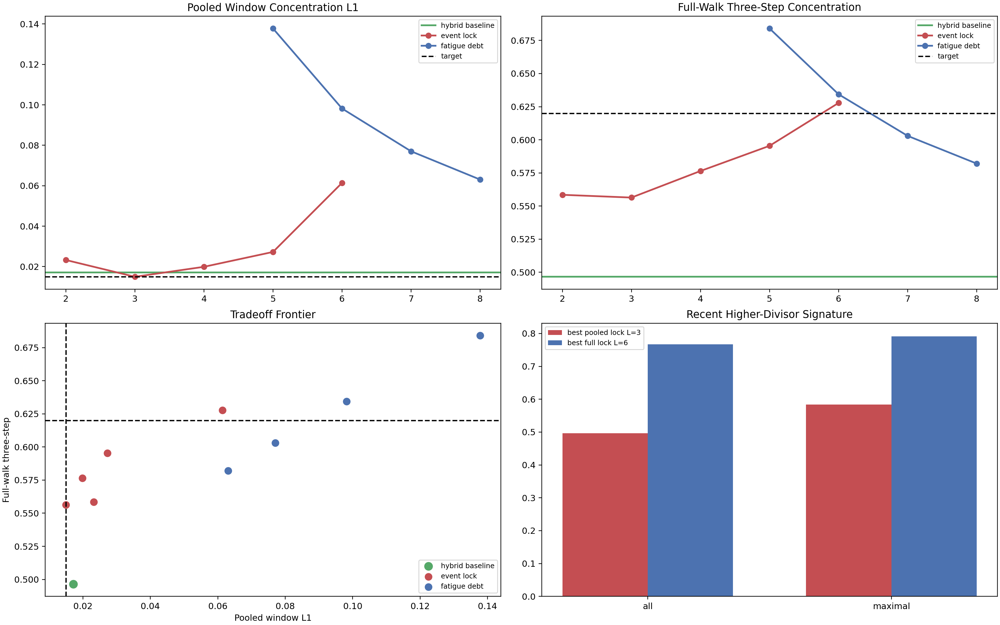

# GWR Gap-Type Long-Horizon Controller Findings

## Observable Facts

The hybrid engine already closed the local-window surface very tightly:

- pooled-window concentration L1: `0.0116`
- best local model:
  `hybrid_lag2_mod8_reset_nontriad_scheduler`

But the stationary million-step walk was still far weaker:

- best stationary three-step concentration: `0.4966`

So the remaining question was narrower than before.

It was no longer “is there a scheduler?” The local data had already answered
that. The live question was:

Can a deterministic long-horizon controller raise the stationary three-step
surface without breaking the local-window fit?

## Controllers Tested

The long-horizon probe keeps the same hybrid base engine,
`hybrid_lag2_mod8_scheduler`, and adds two explicit controller families.

### Event Lock

After any higher-divisor state, the controller enters a finite lock window of
length `L`. During that lock window, the next state is forced to the dominant
successor of the current hybrid context instead of advancing by the balanced
rotor.

This is the most literal finite implementation of a “reset controller.”

### Fatigue Debt

The controller carries a debt variable that increments on ordinary transitions
and resets to `0` on higher-divisor events. Once the debt crosses a threshold
`T`, the walk also snaps to the dominant successor instead of the balanced
rotor.

This is the deterministic version of a slow reset-pressure model.

The exact artifacts are:

- [../../output/gwr_dni_gap_type_long_horizon_controller_probe_summary.json](../../output/gwr_dni_gap_type_long_horizon_controller_probe_summary.json)
- 

## Main Result

The strongest supported result is:

The long-horizon controller frontier is now explicit, and it shows a real
tradeoff rather than a completed engine.

One controller reaches the pooled-window target. A different controller reaches
the stationary three-step target. No single tested controller reaches both at
once.

## The Pooled-Window Winner

The best pooled-window controller is the event-lock controller with `L = 3`.

Its pooled concentrations are:

- one-step: `0.3357`
- two-step: `0.5127`
- three-step: `0.7603`

against the real pooled target:

- one-step: `0.3284`
- two-step: `0.5059`
- three-step: `0.7594`

So the pooled-window concentration L1 drops to `0.0150`.

That essentially hits the requested local target.

Its stationary walk improves materially as well:

- full-walk three-step: `0.5564`

That is much better than the hybrid baseline `0.4966`, but still below the
`0.62` stationary target.

## The Stationary Winner

The best stationary controller in the tested family is the event-lock
controller with `L = 6`.

Its full-walk concentrations are:

- one-step: `0.3038`
- two-step: `0.4259`
- three-step: `0.6278`

So it clears the requested stationary three-step threshold.

But the price is visible on the pooled-window surface:

- pooled-window concentration L1: `0.0614`

So this setting overshoots the local engine and degrades the short-window fit
too much.

## The Fatigue Controller

The fatigue controller confirms the same story.

Its best pooled setting is `T = 8`:

- pooled-window concentration L1: `0.0630`
- full-walk three-step: `0.5820`

Its best stationary setting is `T = 5`:

- full-walk three-step: `0.6840`
- pooled-window concentration L1: `0.1378`

So the fatigue model can drive the stationary walk even harder than the
event-lock controller, but it does so by distorting the local-window surface
too strongly.

That is not a completion result. It is a frontier result.

## What This Means

The current engine now has three empirically distinct layers:

1. a local core grammar on the persistent `14`-state alphabet;
2. a scheduler layer that closes the pooled `256`-window surface;
3. a long-horizon controller layer that can raise stationary concentration but
   currently does so by over-sharpening the local walk.

So the missing layer is now pinned down more exactly than before.

It is not “some reset effect.” The reset effect is real.

The remaining missing piece is a controller that can:

- sharpen the stationary walk like the long event lock or low-threshold fatigue
  controller;
- without collapsing too much of the local-window branching structure.

In ordinary language, the current controllers can either preserve the local
grammar or over-discipline it. The correct long-horizon law must do both.

## Record-Gap Reset Signature

The record-gap signature supports the reset story, but only moderately.

Using the recent higher-divisor window implied by the best pooled controller
(`L = 3`):

- all records with a higher-divisor event in the previous `3` gaps: `0.4961`
- maximal records with a higher-divisor event in the previous `3` gaps:
  `0.5833`

Using the window implied by the best stationary controller (`L = 6`):

- all records with a higher-divisor event in the previous `6` gaps: `0.7674`
- maximal records with a higher-divisor event in the previous `6` gaps:
  `0.7917`

So maximal records are somewhat more likely than the record pool as a whole to
sit inside a recent higher-divisor reset window, especially on the shorter
window. That is a genuine signal, but not yet a sharp mechanistic separator.

## Current Claim

The current supported claim is:

The long-horizon layer is real, and deterministic controllers triggered by
higher-divisor events can raise the stationary three-step concentration above
`0.62`.

What is not yet supported is the stronger completion claim that one finite
deterministic controller simultaneously achieves:

- pooled-window concentration L1 below `0.015`, and
- full-walk three-step concentration above `0.62`.

The present long-horizon result is therefore a frontier, not a closure.
