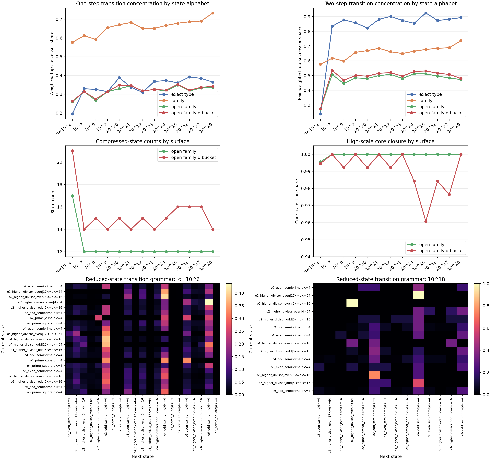

# Gap-Type Sequence Grammar Findings

The gap-type stream does not collapse into a short literal cycle. The stable
result on the exact `10^6` baseline plus sampled decade windows through
`10^18` is a compressed transition grammar.

The strongest settled facts from the sequence probe are:

- the coarse family stream tightens from a one-step top-successor share of
  `0.5767` at `<=10^6` to `0.7333` at `10^18`;
- the `open_family` stream drops from `17` states at `<=10^6` to a stable
  `12`-state high-scale core from `10^7` onward;
- that `12`-state `open_family` core is fully closed on the sampled `10^7`
  and `10^18` windows and remains effectively closed on the exact baseline,
  with transition-core share `0.9956`;
- adding a coarse divisor bucket to form the reduced state
  `open_family|d_bucket` does not create a strong new one-step law;
- the real gain from that reduced state appears at two-step depth, where the
  pair top-successor share jumps above `0.50` on the sampled high-scale
  windows.

## Reduced State

The probe uses the deterministic reduced state `open_family|d_bucket`, with
divisor buckets:

- `d<=4`
- `5<=d<=16`
- `17<=d<=64`
- `d>64`

This keeps the state definition local to the exact winner and uses only fields
already present in the gap-type catalog detail CSV.

## Measured Surface

| Surface | `open_family` one-step | reduced one-step | `open_family` pair | reduced pair | `open_family` states | reduced states |
|---|---:|---:|---:|---:|---:|---:|
| `<=10^6` | `0.2597` | `0.2631` | `0.2716` | `0.2750` | `17` | `21` |
| `10^7` | `0.3137` | `0.3137` | `0.5079` | `0.5354` | `12` | `14` |
| `10^12` | `0.3176` | `0.3176` | `0.5079` | `0.5197` | `12` | `15` |
| `10^18` | `0.3373` | `0.3412` | `0.4724` | `0.4803` | `12` | `14` |

The one-step improvement from the divisor bucket is small:

- `<=10^6`: `0.2597 -> 0.2631`
- `10^18`: `0.3373 -> 0.3412`

So the next-gap grammar is not being driven mainly by the current winner's
coarse divisor band.

The two-step view is different. Once the previous reduced state is included,
the same surface moves to:

- `0.5354` at `10^7`,
- `0.5197` at `10^12`,
- `0.4803` at `10^18`.

That is the signal the reduced-state probe exposes: the compressed grammar is
real, but it behaves more like a short-memory transition law than a strong
memoryless one-step law.

## High-Scale Core

The post-baseline `open_family` core is the same `12` states on every sampled
surface from `10^7` through `10^18`:

- `o2_even_semiprime`
- `o2_higher_divisor_even`
- `o2_higher_divisor_odd`
- `o2_odd_semiprime`
- `o4_even_semiprime`
- `o4_higher_divisor_even`
- `o4_higher_divisor_odd`
- `o4_odd_semiprime`
- `o6_even_semiprime`
- `o6_higher_divisor_even`
- `o6_higher_divisor_odd`
- `o6_odd_semiprime`

The reduced-state core adds coarse divisor structure to that scaffold and
settles to `14` persistent states:

- `o2_even_semiprime|d<=4`
- `o2_higher_divisor_even|5<=d<=16`
- `o2_higher_divisor_even|17<=d<=64`
- `o2_higher_divisor_even|d>64`
- `o2_higher_divisor_odd|5<=d<=16`
- `o2_odd_semiprime|d<=4`
- `o4_even_semiprime|d<=4`
- `o4_higher_divisor_even|5<=d<=16`
- `o4_higher_divisor_odd|5<=d<=16`
- `o4_odd_semiprime|d<=4`
- `o6_even_semiprime|d<=4`
- `o6_higher_divisor_even|5<=d<=16`
- `o6_higher_divisor_odd|5<=d<=16`
- `o6_odd_semiprime|d<=4`

Its closure is also strong:

- exact baseline reduced-state core transition share: `0.9946`
- sampled `10^7`: `1.0000`
- sampled `10^12`: `0.9922`
- sampled `10^18`: `1.0000`

So the high-scale grammar is not just smaller than the exact baseline. It is
nearly closed under the observed transitions.

## Reading

The stable object is:

- not the literal exact `type_key` stream;
- not a short deterministic cycle;
- but a finite transition grammar on the compressed gap-type scaffold.

The main consequence of this probe is operational. If the next predictive step
is meant to stay arithmetic and local, the better target is not a richer
memoryless state alphabet. The better target is a second-order grammar on a
small compressed state, because that is where the measured concentration
actually tightens.

