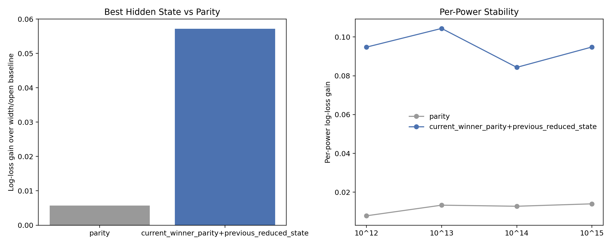

# Hidden-State Miner Findings

The strongest hidden-state candidate on the current `10^12..10^15` surface is `current_winner_parity+previous_reduced_state`, which improves matched next-gap triad-return log loss by `0.057152` over the width/open baseline. It beats parity alone by `0.051474`.

This looks like a genuinely new hidden state.

## Current Winner

- best candidate: `current_winner_parity+previous_reduced_state`
- primitive count: `2`
- candidate cardinality: `34`
- matched next-triad lift: `1.0000`
- within-triad lane L1 shift: `1.0000`
- best label: `odd|o2_higher_divisor_odd|17<=d<=64` with triad share `1.0000`
- worst label: `even|o4_higher_divisor_odd|17<=d<=64` with triad share `0.0000`

## Parity Baseline

- parity log-loss gain: `0.005678`
- parity matched next-triad lift: `0.0349`

## Per-Power Gains

- `10^12`: `0.094760`
- `10^13`: `0.104396`
- `10^14`: `0.084331`
- `10^15`: `0.094820`

## Reading

The main question after this run is whether the best candidate survives once current winner offset is added as a direct control inside the parity probe itself, rather than only as a hidden-state label.

## Artifacts

- [hidden-state miner script](../../benchmarks/python/predictor/gwr_hidden_state_miner.py)
- [summary JSON](../../output/gwr_hidden_state_miner_summary.json)
- [candidate CSV](../../output/gwr_hidden_state_miner_candidates.csv)
- [history JSONL](../../output/gwr_hidden_state_miner_history.jsonl)
- 
