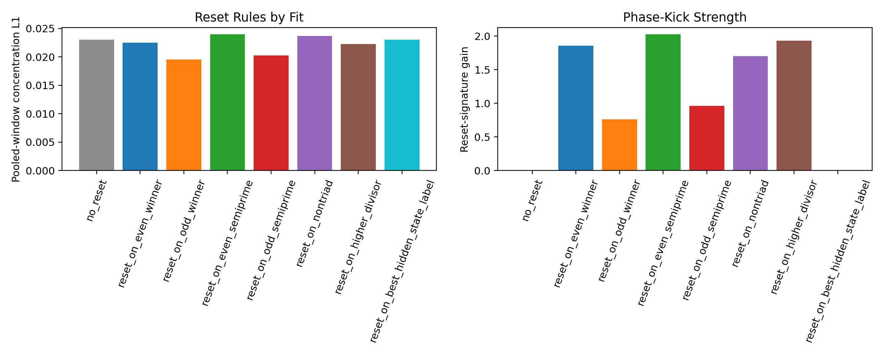

# Phase-Reset Hunter Findings

The best reset law over the `hidden_state_augmented_rotor` base recipe is `reset_on_odd_winner` with pooled-window concentration L1 `0.0196`, three-step concentration `0.3970`, and reset-signature gain `0.7611`.

Parity behaves like a genuine phase kick on this surface.

## Rule Table

- `reset_on_odd_winner`: pooled L1 `0.0196`, three-step `0.3970`, reset gain `0.7611`
- `reset_on_odd_semiprime`: pooled L1 `0.0203`, three-step `0.4046`, reset gain `0.9592`
- `reset_on_higher_divisor`: pooled L1 `0.0223`, three-step `0.4136`, reset gain `1.9311`
- `reset_on_even_winner`: pooled L1 `0.0225`, three-step `0.4145`, reset gain `1.8562`
- `no_reset`: pooled L1 `0.0231`, three-step `0.4502`, reset gain `0.0000`
- `reset_on_best_hidden_state_label`: pooled L1 `0.0231`, three-step `0.4502`, reset gain `0.0000`
- `reset_on_nontriad`: pooled L1 `0.0237`, three-step `0.4021`, reset gain `1.6991`
- `reset_on_even_semiprime`: pooled L1 `0.0240`, three-step `0.4370`, reset gain `2.0247`

## Artifacts

- [phase reset hunter script](../../benchmarks/python/predictor/gwr_phase_reset_hunter.py)
- [summary JSON](../../output/gwr_phase_reset_hunter_summary.json)
- [rules CSV](../../output/gwr_phase_reset_hunter_rules.csv)
- [history JSONL](../../output/gwr_phase_reset_hunter_history.jsonl)
- 
