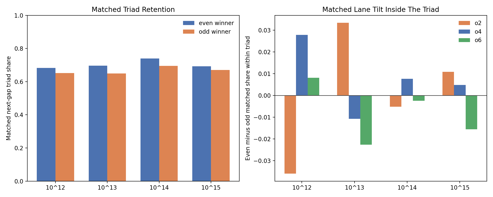

# Winner Parity Next-Opening Probe Findings

When current winners are matched by the exact same current gap width and the
exact same current first-open offset, even winners feed the next gap back into
the odd-semiprime triad more often than odd winners do on the `10^12..10^15`
probe surface.

The measured combined matched next-triad shares are:

- even winners: `0.7023`
- odd winners: `0.6662`

That is a matched lift of about `3.61` percentage points for the event
"the next gap opens in one of the three dominant odd-semiprime triad lanes."

What does **not** become large on the same surface is the within-triad lane
split. After conditioning on the next gap already being in the triad, the
combined matched lane shares are:

- even winners:
  - `o2_odd_semiprime|d<=4`: `0.4070`
  - `o4_odd_semiprime|d<=4`: `0.3536`
  - `o6_odd_semiprime|d<=4`: `0.2394`
- odd winners:
  - `o2_odd_semiprime|d<=4`: `0.4068`
  - `o4_odd_semiprime|d<=4`: `0.3458`
  - `o6_odd_semiprime|d<=4`: `0.2474`

So the parity effect is real on this probe surface, but it looks more like a
short one-step **triad re-entry preference** than a strong single-lane
steering law.

## Measured Surface

The probe uses one deterministic matched comparison:

1. sample consecutive exact transitions from the decade anchors `10^12`,
   `10^13`, `10^14`, and `10^15`;
2. classify the current winner parity as even or odd;
3. stratify by current gap width and current first-open offset;
4. keep only overlap strata where both parities occur;
5. compare the next-gap triad-lane shares under the same stratum mix.

This is the user's requested control surface. It removes the first-order width
and starting-offset imbalance between even-winner and odd-winner populations.

## Per-Power Readout

| Power | Matched next-triad share after even | Matched next-triad share after odd | Lift |
|---|---:|---:|---:|
| `10^12` | `0.6823` | `0.6523` | `+0.0300` |
| `10^13` | `0.6967` | `0.6497` | `+0.0470` |
| `10^14` | `0.7399` | `0.6956` | `+0.0443` |
| `10^15` | `0.6927` | `0.6698` | `+0.0229` |

The sign is stable across all four sampled anchors for this broader triad
re-entry effect.

The finer lane split inside the triad is weaker:

- `o4_odd_semiprime|d<=4` is modestly higher after even winners on the
  combined surface;
- `o6_odd_semiprime|d<=4` is modestly lower after even winners on the
  combined surface;
- `o2_odd_semiprime|d<=4` is nearly unchanged on the combined surface.

That means the strongest supported phrasing is not "even winners pick one exact
lane." The strongest supported phrasing is:

> even winners make next-gap return to the odd-semiprime triad more likely, and
> the remaining inside-triad tilt is present but small.

## Reading

There may be something here.

On the actual claim, the probe supports a real one-step memory effect after
matching on current width and current first-open offset. But the dominant
effect is not a large parity-only selector for one lane. The larger effect is
that even winners hand the walk back to the dominant triad more often.

The most useful next discriminator is:

- rerun the same matched comparison with current carrier family held fixed, so
  we can separate parity itself from the even-semiprime versus odd-semiprime
  family split;
- then add current winner offset as a second control to test whether the
  parity signal survives after local position is also fixed.

## Artifacts

- [winner parity next-opening probe script](../../benchmarks/python/predictor/gwr_winner_parity_next_opening_probe.py)
- [summary JSON](../../output/gwr_winner_parity_next_opening_probe_summary.json)
- [matched-stratum CSV](../../output/gwr_winner_parity_next_opening_probe_strata.csv)
- 
