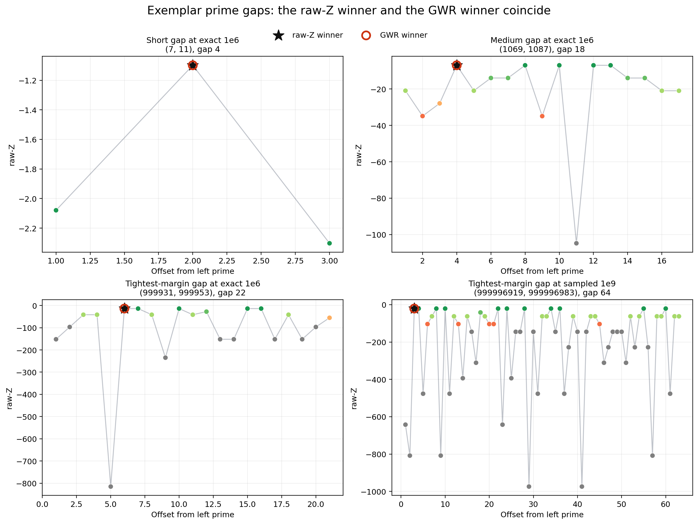
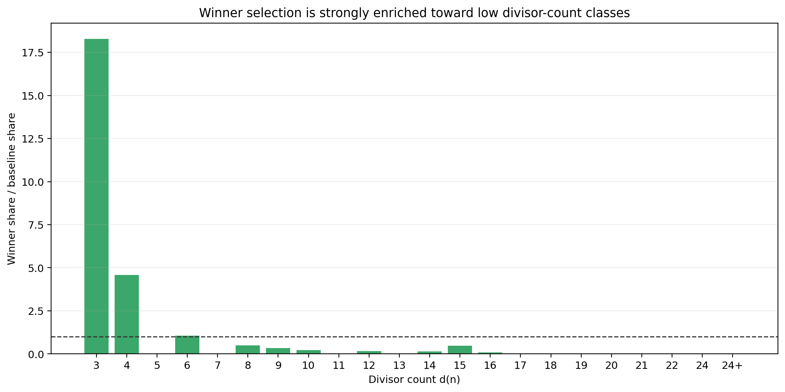
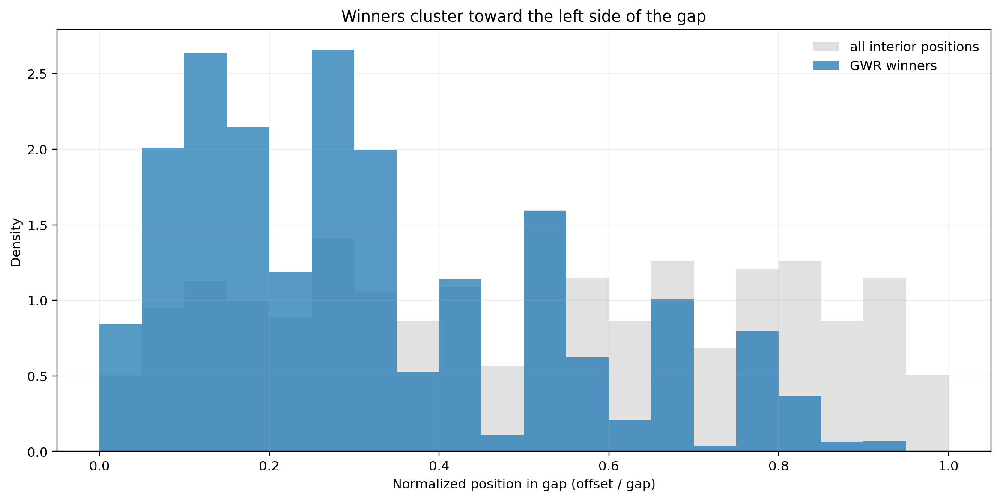
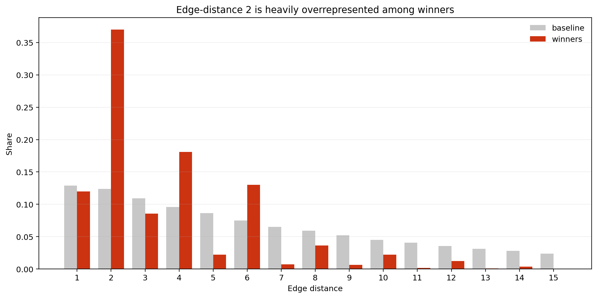
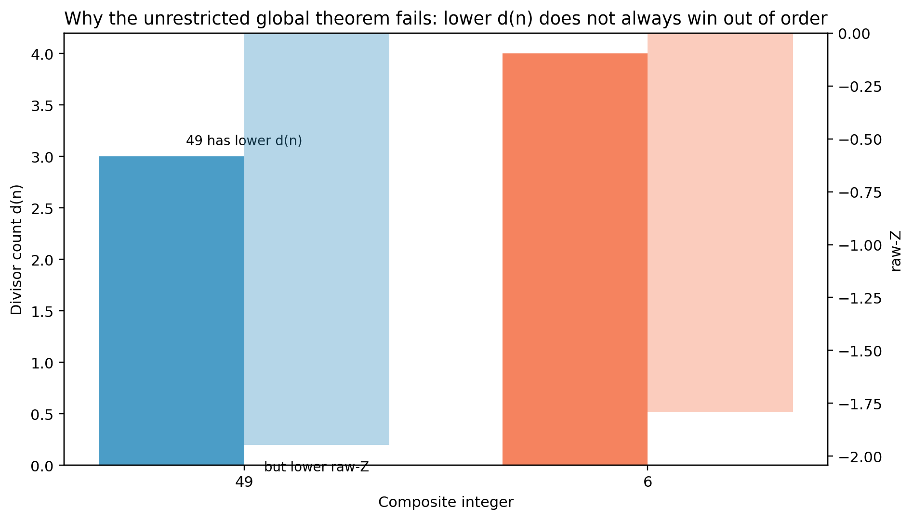
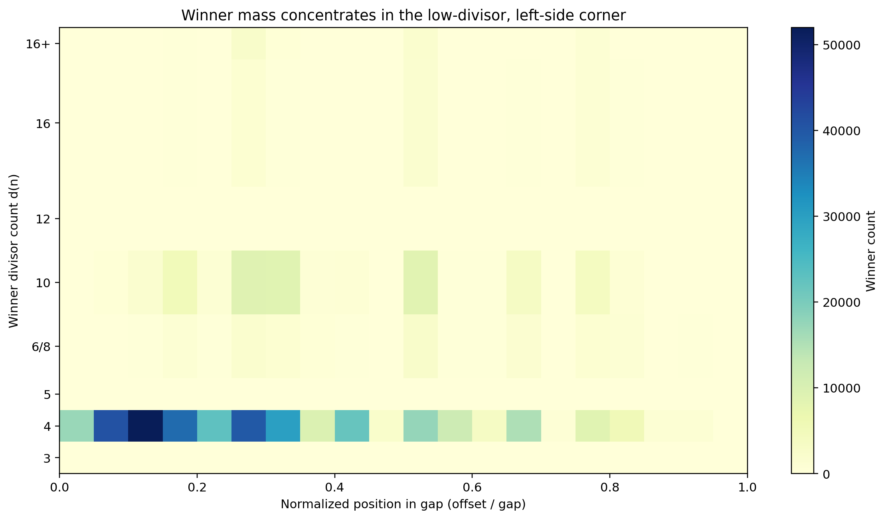

# The Gap Winner Rule

## How a geometric-looking score collapsed to a simple arithmetic law

Take two consecutive prime numbers, like $13$ and $17$.
The numbers in between, $14, 15, 16$, are the interior of the gap.
In a prime gap, every interior number is composite.

I wanted to compare those interior composites using one numerical quantity.
The quantity was designed to favor numbers with fewer divisors, while also taking
into account how large the number is. A number with fewer divisors is, in that
limited sense, arithmetically simpler than one with many divisors.

The underlying multiplicative quantity is

$$
Z_{\mathrm{raw}}(n) = n^{\,1 - d(n)/2}.
$$

Here $d(n)$ means the number of positive divisors of $n$. In the project notes,
this is the raw-$Z$ quantity.

The implementation compares winners using its logarithm,

$$
L(n) = \ln Z_{\mathrm{raw}}(n) = \left(1 - \frac{d(n)}{2}\right)\ln(n).
$$

Because the logarithm is strictly increasing on positive inputs, maximizing
$L(n)$ is equivalent to maximizing raw-$Z$.

At the beginning, I was not looking for a simple winner rule.
I was only trying to understand a repeated visual pattern: when I plotted this
log-score across the interior of many prime gaps, the peak kept leaning toward
the left side of the gap.

That is where the story starts.

## The log-score looked geometric before it looked arithmetic

If you look at individual gaps, the implemented log-score landscape really does
look like a profile. Some carriers sit high, some collapse deep negative, and
the peak often leans toward the left side of the gap. That is exactly why the
result was surprising once it appeared.

The key local fact is visible in exemplar gaps: the log-score winner and the
minimum-divisor leftmost winner land on the same carrier.

The top-left panel shows the smallest nontrivial eligible gap. The lower panels
show tighter-margin examples where several interiors compete more closely. Even
there, the black star marking the log-score winner sits exactly on the red ring
marking the Gap Winner Rule winner.

That identity is the main discovery.

## The surprise was not that the winner leaned left

The surprise was that the winner collapsed completely.

On the tested prime-gap surface, the implemented log-score winner is exactly
the same as the integer selected by the simple rule:

1. choose the smallest interior divisor count $d(n)$,
2. among ties, choose the leftmost interior integer.

That is the Gap Winner Rule (GWR).

The important point is that GWR is not a loose summary on the tested surface.
It is an exact identity on the current validation ladder, from exact runs at
$10^6$ and $2 \times 10^7$ through sampled higher-scale windows out to $10^{12}$.

The figure above shows the current ladder of reported validation regimes. The
line stays at match rate $1.0$ throughout. The anchor table beneath it keeps
the gap counts readable without overloading the chart.

So the headline is not “the log-score often agrees with a simpler rule.” The
headline is: on the tested surface, the log-score winner and the rule winner
are the same point.

## One winner law explains several separate-looking phenomena

Before GWR, several observations looked like distinct facts:

- $d(n)=4$ winners appeared unusually often,
- winners appeared unusually often in the left half of the gap,
- edge-distance $2$ showed up again and again.

Once GWR is in view, those observations compress into one mechanism.

The divisor-count effect becomes clear when winners are compared against the
baseline availability of divisor classes across all interior composites.

This plot is not showing raw counts. It is showing selection pressure. A bar
above $1$ means that divisor class is chosen more often than its baseline
availability would predict. The dominant winner classes are the lowest ones
available, especially $d(n)=3$ and $d(n)=4$. On the tested prime-gap surface,
the frequent winner class is $d(n)=4$ because it is the first abundant low-
divisor class that regularly appears in gap interiors.

The left-edge effect shows up just as clearly if winner positions are compared
with the baseline distribution of all interior positions.

The gray histogram is what you would get from all interior positions. The blue
histogram is where the winners actually land. The winner mass is pulled left.

The edge-distance view isolates this even more sharply.

Edge-distance $2$ stands out immediately. That is not a separate law. It is one
of the visible consequences of the same winner rule when low-divisor carriers
appear near the left boundary of the gap.

So the right reading is not that I discovered several unrelated regularities.
The right reading is that one exact winner law explains them together.

## The first theorem temptation was stronger than the truth

Once the collapse appeared, the natural next thought was that the log-score,
equivalently raw-$Z$, might be
globally lexicographic on composites, not just inside prime gaps.

That stronger claim would say, in effect, that lower divisor count always wins,
with smaller integer breaking ties, even for arbitrary unordered composite
pairs.

That stronger claim is false.

One explicit counterexample is the pair $49$ and $6$.

Here $49$ has smaller divisor count than $6$, but it does not have larger
log-score. Equivalently, it does not have larger raw-$Z$. That matters because
it tells us not to over-read the empirical prime-gap result into a broader
unrestricted theorem that the implemented comparison does not actually satisfy.

This correction strengthens the story rather than weakening it. It tells us
exactly where the real mathematical question lives.

## What survives exactly

The exact theorem that survives is narrower and cleaner.

If $a < b$ are composite integers and $d(a) \leq d(b)$, then
$L(a) > L(b)$, equivalently $Z_{\mathrm{raw}}(a) > Z_{\mathrm{raw}}(b)$.

This is the Lexicographic Raw-Z Dominance Theorem. It is a directional
dominance result, not an unrestricted global ordering law. Earlier composite
plus no larger divisor count forces larger log-score, equivalently larger
raw-$Z$.

That distinction matters. It means the theorem is not “lower divisor count wins
everywhere.” It is “lower-or-equal divisor count wins when it occurs earlier.”

That surviving statement is still powerful, because it suggests the prime-gap
question is no longer about proving a score identity from nothing. The question
becomes: why do prime-gap interiors appear always to place the winner inside
that ordered-dominance regime?

## The remaining open question is now sharper

The open problem is no longer vague.

It is not:

“Why does this log-score happen to look left-leaning?”

It is:

“Why do prime-gap interiors seem always to arrange themselves so that the
minimum-divisor leftmost carrier dominates the log-score competition?”

The heatmap below shows where the winners actually live on the tested prime-gap
surface.

The winner mass sits heavily in the low-divisor, left-side corner. That picture
captures the whole story in one frame. The log-score looks continuous. The
winner law looks discrete. The tested prime-gap interiors land in the corner
where the discrete law wins.

That is why GWR matters.

It does not merely say that a geometric-looking score often peaks near the left
edge. On the tested surface, it says that the implemented log-score winner,
equivalently the raw-$Z$ winner, is governed by a simpler arithmetic law than
the formula first suggests.

The strongest supported statement at this stage is therefore:

The Gap Winner Rule is an exact winner law on the tested prime-gap surface, and
it compresses several previously separate-looking observations into one
selection rule.

The central open question is whether prime-gap interiors satisfy a deeper
structural condition that forces that rule to hold, and whether that condition
can be stated and proved cleanly.

See [gap_winner_rule.md](../findings/gap_winner_rule.md) for the formal
statement and legacy-name notes.
